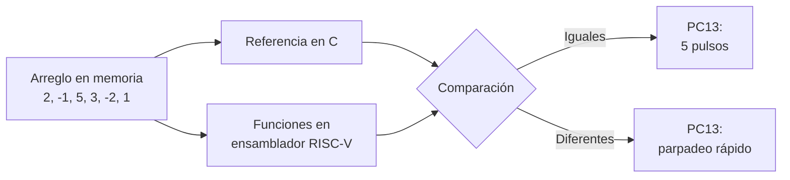
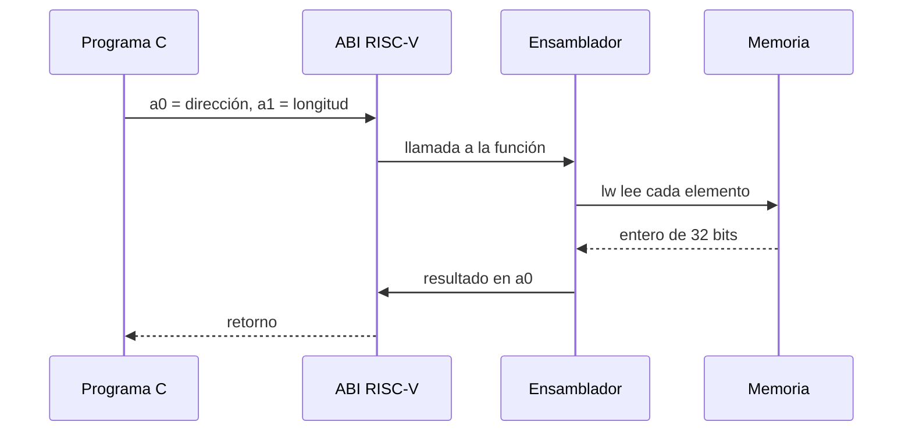

# Procesamiento de arreglos en ensamblador RISC-V con GD32VW553

**Unidad:** Procesamiento y transferencia de información en sistemas embebidos RISC-V  
**Autora:** Laura Daniela Barragán Silva  
**Plataforma:** GD32VW553HMQ6/HMQ7  
**Arquitectura:** RISC-V RV32

## Propósito

El proyecto llama desde C a dos funciones escritas en ensamblador RISC-V. Las
funciones recorren un arreglo de enteros de 32 bits, calculan su suma y su
máximo, y retornan los resultados mediante la ABI de RISC-V.

El cálculo se repite en C como referencia. Si ambas implementaciones coinciden,
el LED PC13 emite cinco pulsos. Si no coinciden, parpadea rápidamente.

## Objetivos

- Comprender la interacción entre C y ensamblador.
- Reconocer argumentos y retornos en a0 y a1.
- Usar los temporales t0, t1 y t2.
- Recorrer memoria mediante punteros y lw.
- Interpretar negativos en complemento a dos.
- Depurar registros y variables en VS Code.

## Datos y resultados

    {2, -1, 5, 3, -2, 1}

| Operación | C | Ensamblador |
|---|---:|---:|
| Suma | 8 | 8 |
| Máximo | 5 | 5 |

Variables esperadas:

    g_sum_c          = 8
    g_sum_asm        = 8
    g_max_c          = 5
    g_max_asm        = 5
    g_results_match  = 1

## Diagrama de bloques

## Flujo de registros

| Registro | Función |
|---|---|
| a0 (x10) | Dirección inicial y luego resultado |
| a1 (x11) | Número de elementos |
| t0 (x5) | Puntero o máximo temporal |
| t1 (x6) | Contador o dato leído |
| t2 (x7) | Elemento usado durante la suma |
| ra (x1) | Dirección de retorno |
| sp (x2) | Puntero de pila |

La explicación completa está en
[Conceptos y preguntas](Doc/3_CONCEPTS_AND_QUESTIONS.md).

## Resultado físico

    Cinco destellos cortos
            ↓
    Pausa aproximada de 1,5 segundos
            ↓
    Repetición

No se requiere protoboard ni componentes externos.

## Inicio rápido

1. Copie tools/local_config.example.ps1 como tools/local_config.ps1.
2. Configure las tres rutas locales.
3. Abra esta carpeta como raíz en VS Code.
4. Ejecute Build + Flash GD32 Assembly Array.

Comandos equivalentes:

    powershell -NoProfile -ExecutionPolicy Bypass -File .\tools\configure.ps1 -BuildType Debug
    cmake --build --preset build-debug
    powershell -NoProfile -ExecutionPolicy Bypass -File .\tools\flash.ps1 -BuildType Debug

## Depuración

    powershell -NoProfile -ExecutionPolicy Bypass -File .\tools\create_debug_config.ps1

Use Step Into para entrar en Src/array_riscv.S y despliegue Registers.

## Documentación

- [Configuración](Doc/1_SETUP.md)
- [Compilación y programación](Doc/2_BUILD_AND_FLASH.md)
- [Conceptos, registros y preguntas](Doc/3_CONCEPTS_AND_QUESTIONS.md)
- [Depuración](Doc/4_DEBUGGING.md)
- [Solución de problemas](Doc/5_TROUBLESHOOTING.md)
